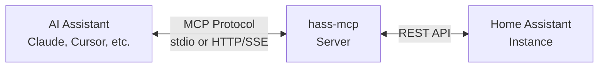

<p align="center">
  
</p>

<p align="center">
  
  
</p>

An MCP server that exposes Home Assistant functionality to AI assistants. Built in Go, it enables AI clients like Claude, Cursor, or OpenAI to interact with your smart home through the [Model Context Protocol](https://modelcontextprotocol.io/).

## Features

- **Entity Management**: Query, search, and control Home Assistant entities
- **Service Calls**: Execute any Home Assistant service through the AI
- **System Insights**: Get overviews, domain summaries, and entity history
- **Troubleshooting**: Access error logs and automation states
- **Flexible Transport**: Supports both stdio (local) and HTTP (remote) modes
- **Production Ready**: Includes OAuth support, JWT validation, Dockerfile, and Helm chart

## Available Tools

| Tool               | Description                                              |
| ------------------ | -------------------------------------------------------- |
| `get_version`      | Get the Home Assistant version                           |
| `get_entity`       | Get state of a specific entity (with optional filtering) |
| `entity_action`    | Turn entities on, off, or toggle them (with params)      |
| `list_entities`    | List entities with optional domain/search filters        |
| `search_entities`  | Search entities by name, ID, or attributes               |
| `domain_summary`   | Get statistics and state distribution for a domain       |
| `system_overview`  | Get a complete overview of the HA system                 |
| `list_automations` | List all automations with their states                   |
| `call_service`     | Call any Home Assistant service (low-level API)          |
| `get_history`      | Get state change history for an entity                   |
| `get_error_log`    | Retrieve the Home Assistant error log                    |
| `restart_ha`       | Restart Home Assistant                                   |

## Quick Start

### Requirements

- Go 1.24 or later (only for building from source)
- Home Assistant instance with API access
- Long-lived access token from Home Assistant

### Obtaining a Home Assistant Token

1. Navigate to your Home Assistant instance
2. Click on your profile (bottom left)
3. Scroll to "Long-Lived Access Tokens"
4. Create a new token and copy it

### Installation

#### Build from Source

```bash
git clone https://github.com/achetronic/hass-mcp.git
cd hass-mcp
make build
```

The binary will be created at `bin/hass-mcp-{os}-{arch}`.

#### Docker

```bash
docker pull ghcr.io/achetronic/hass-mcp:latest
```

Or build locally:

```bash
make docker-build IMG=your-registry/hass-mcp:latest
```

## Configuration

Create a configuration file based on the examples in [`docs/`](./docs/):

### Stdio Mode (Local Clients)

```yaml
server:
  name: "Home Assistant MCP"
  version: "0.1.0"
  transport:
    type: "stdio"

home_assistant:
  url: "${HA_URL}" # e.g., http://homeassistant.local:8123
  token: "${HA_TOKEN}" # Long-lived access token
```

### HTTP Mode (Remote Clients)

#### Basic HTTP Server (Private Network)

For internal use or development, you can run a simple HTTP server without authentication:

```yaml
server:
  name: "Home Assistant MCP"
  version: "0.1.0"
  transport:
    type: "http"
    http:
      host: ":8080"

home_assistant:
  url: "${HA_URL}"
  token: "${HA_TOKEN}"
```

#### HTTP Server with OAuth 2.1 (Public Exposure)

For public-facing deployments, the server supports [OAuth 2.1](https://oauth.net/2.1/) with JWT validation. This enables secure access from remote AI clients like Claude Web or ChatGPT by delegating authentication to an identity provider (Keycloak, Auth0, Okta, etc.).

The server implements:

- **RFC 8414**: OAuth Authorization Server Metadata (`/.well-known/oauth-authorization-server`)
- **RFC 9728**: OAuth Protected Resource Metadata (`/.well-known/oauth-protected-resource`)

```yaml
server:
  name: "Home Assistant MCP"
  version: "0.1.0"
  transport:
    type: "http"
    http:
      host: ":8080"

home_assistant:
  url: "${HA_URL}"
  token: "${HA_TOKEN}"

middleware:
  jwt:
    enabled: true
    validation:
      strategy: "local" # Validate JWTs internally using JWKS
      local:
        jwks_uri: "https://keycloak.example.com/realms/mcp-servers/protocol/openid-connect/certs"
        cache_interval: "10s"
        # Optional: CEL expressions to validate JWT claims
        allow_conditions:
          - expression: 'payload.groups.exists(g, g == "home-assistant-users")'

oauth_authorization_server:
  enabled: true
  issuer_uri: "https://keycloak.example.com/realms/mcp-servers"

oauth_protected_resource:
  enabled: true
  resource: "https://hass-mcp.example.com/mcp"
  auth_servers:
    - "https://keycloak.example.com/realms/mcp-servers"
  scopes_supported:
    - openid
    - profile
```

> **Tip**: If you have an upstream proxy (e.g., Istio) that validates JWTs, you can use `strategy: "external"` and configure `forwarded_header` to receive the validated JWT from the proxy.

> **Note**: Environment variables are supported using `${VAR}` syntax.

See [`docs/config-http.yaml`](./docs/config-http.yaml) for a complete configuration example.

## Usage

### Local Clients (Claude Desktop, Cursor, VS Code)

For local AI clients, use stdio transport. Add to your client configuration:

**Claude Desktop** (`claude_desktop_config.json`):

```json
{
  "mcpServers": {
    "home-assistant": {
      "command": "/path/to/hass-mcp",
      "args": ["--config", "/path/to/config-stdio.yaml"],
      "env": {
        "HA_URL": "http://homeassistant.local:8123",
        "HA_TOKEN": "your-token-here"
      }
    }
  }
}
```

**Cursor** (`.cursor/mcp.json`):

```json
{
  "mcpServers": {
    "home-assistant": {
      "command": "/path/to/hass-mcp",
      "args": ["--config", "/path/to/config-stdio.yaml"],
      "env": {
        "HA_URL": "http://homeassistant.local:8123",
        "HA_TOKEN": "your-token-here"
      }
    }
  }
}
```

### Remote Clients (Claude Web, OpenAI)

For remote clients, use HTTP transport:

```bash
export HA_URL="http://homeassistant.local:8123"
export HA_TOKEN="your-token-here"
./hass-mcp --config config-http.yaml
```

The server starts on port 8080 by default. Available endpoints depend on your configuration:

| Endpoint                                  | Description                            | When Enabled                               |
| ----------------------------------------- | -------------------------------------- | ------------------------------------------ |
| `/mcp`                                    | MCP protocol endpoint                  | Always                                     |
| `/.well-known/oauth-authorization-server` | OAuth metadata (RFC 8414)              | `oauth_authorization_server.enabled: true` |
| `/.well-known/oauth-protected-resource`   | Protected resource metadata (RFC 9728) | `oauth_protected_resource.enabled: true`   |

## Development

```bash
# Run the server
make run

# Format code
make fmt

# Run linter
make lint

# Run linter with auto-fix
make lint-fix

# Build binary
make build

# Show all available targets
make help
```

## Deployment

### Kubernetes

A Helm chart is provided in the [`chart/`](./chart/) directory:

```bash
# Update dependencies
helm dependency update ./chart

# Install
helm install hass-mcp ./chart \
  --set config.home_assistant.url="http://homeassistant.local:8123" \
  --set config.home_assistant.token="your-token-here"
```

Configure values in `chart/values.yaml` to match your environment.

### Production Recommendations

- **Authentication**: Use a reverse proxy (e.g., Istio, Traefik) for JWT validation in production
- **OAuth**: Enable OAuth endpoints for remote client authentication
- **Session Affinity**: Use a consistent hash router for session affinity when running multiple replicas
- **Secrets**: Store tokens in Kubernetes secrets or external secret managers

## Project Structure

```
├── cmd/main.go              # Application entry point
├── api/                     # Configuration types
├── internal/
│   ├── hass/                # Home Assistant API client
│   ├── tools/               # MCP tool implementations
│   ├── handlers/            # HTTP endpoint handlers
│   ├── middlewares/         # HTTP/JWT middlewares
│   ├── config/              # Configuration loading
│   └── globals/             # Application context
├── docs/                    # Example configurations
└── chart/                   # Helm chart for Kubernetes
```

## How It Works



1. The AI assistant connects to hass-mcp via MCP (stdio for local clients, HTTP/SSE for remote)
2. The assistant can discover available tools and call them
3. hass-mcp translates tool calls into Home Assistant REST API requests
4. Results are returned to the assistant in a structured format

## Related Links

- [Model Context Protocol Specification](https://modelcontextprotocol.io/)
- [Home Assistant REST API](https://developers.home-assistant.io/docs/api/rest/)
- [mcp-go Library](https://github.com/mark3labs/mcp-go)

## Contributing

Contributions are welcome. Please open an issue to discuss changes before submitting a pull request.

## License

This project is licensed under the Apache 2.0 License. See [LICENSE](./LICENSE) for details.
